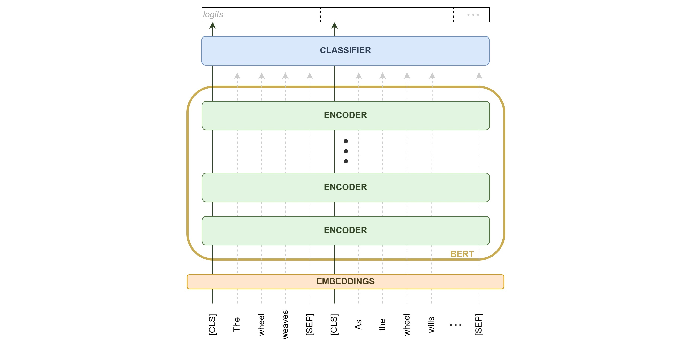

# Text Summarization

This repository presents a fine-tuning pipeline for BERT, aiming at Extractive Summarization tasks.

The architecture is the following:



## Converting Abstractive to Extractive

There is a lack of datasets available to train models for the extractive summarization task. Thus, the [`abs_to_ext.py`](abs_to_ext.py) script allows you to convert existing datasets designed for abstractive summarization tasks to a format suitable for extractive tasks. This conversion is achieved through a greedy algorithm from Liu (2019), maximizing the ROUGE score by iteratively adding sentences to the extractive summary. Alas, the extractive summaries are biased towards the first sentences of the context, but checking every possible combination is not feasible.

To convert a dataset, you can use the following command:

```bash
python abs_to_ext.py \
    -f cnn_dailymail \ # Dataset path
    -c '3.0.0' \ # Optional: Dataset version or other info
    -hf \ # Specify if the dataset is from HuggingFace hub
    -s 'article' \ # Field name for the text
    -t 'highlights' \ # Field name for the abstractive summary
    -sz 3 \ # Number of sentences desired in the extractive summary
    -m 'greedy' \ # Selection algorithm ('greedy', 'combination')
    -o data/ext_cnn_dailymail # Output path for the new DatasetDictionary
```

## Data Preparation & Training

Data preparation is carried out as proposed by Liu (2019) as well. The text is split into sentences, tokenized, and sentences that are too long (short) are trimmed (discarded). The tokenized text is then pruned to 512 tokens, which may lead to loss of information in longer examples.

The [`trainer.py`](src/trainer.py) and [`metrics.py`](src/metrics.py) files handle the fine-tuning process, offering a simplified version of the HuggingFace pipeline. The [`run_extsum.py`](run_extsum.py) script handles data preprocessing ([`data_preparation.py`](src/data_preparation.py)) and model training. Please note, this implementation is designed for BERT and may require tweaks for other models. Run configurations are stored in [`config.json`](configs/config.json).

Use the following command to start training:

```bash
python run_extsum.py \
    -i data/ext_cnn_dailymail \ # Path to the data
    -o data/prep_ext_cnn_dailymail \ # Preprocessed data will be stored here
    -c config.json \ # Configuration file for the run
    -d checkpoints/bertsum/ # Path to save the checkpoints
```

## Evaluation

Evaluation is done using the ROUGE metric available at HuggingFace's `evaluation` library. To evaluate the model, use the [`evaluate_model.py`](evaluate_model.py) script as follows:

```bash
python evaluate_model.py \
  --model checkpoints/bertsum/bertsum \ # Path to the model checkpoint
  --dataset data/ext_cnn_dailymail \ # Dataset for evaluation
  --save_dir checkpoints/bertsum \ # Path to save ROUGE results
  --save_name results.json # Name of the results file
```
